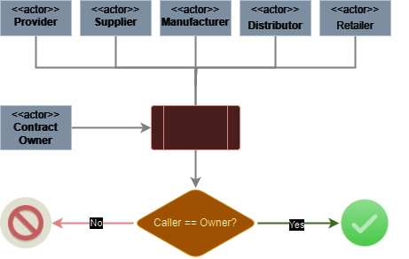
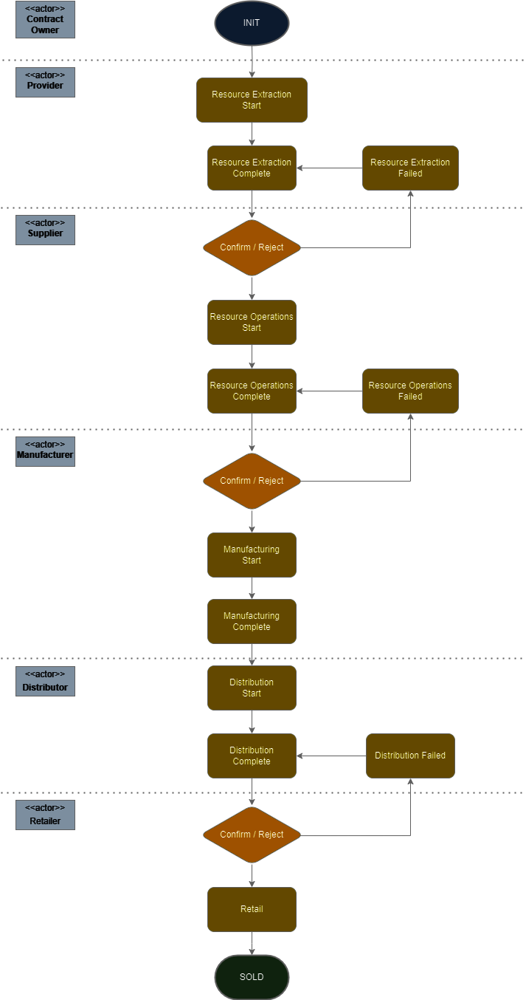

<h1 align="center">
  <br>
  
  <br>  
  CDS 2024<br/>Supply Chain Management over Blockchain
  <br>
</h1>

<h4 align="center">Generic supply chain management contract written in <a href="https://docs.soliditylang.org/en/v0.8.4/" target="_blank">Solidity</a>.</h4>

# Table of Contents
1. [Description](#description)
2. [Architecture](#architecture)
3. [Operations Chain Flow](#operations-chain-flow)
4. [Smart Contract Implementation](#smart-contract-implementation)
   - [ISupplyChain.sol: Abstract Contract Overview](#isupplychainsol-abstract-contract-overview)
     - [Main Entities](#main-entities)
       - [Actors](#actors)
       - [Product](#product)
     - [Methods / Functionalities](#methods--functionalities)
   - [SimpleSupplyChain.sol: A Simplistic Supply Chain Implementation](#simplesupplychainsol-a-simplistic-supply-chain-implementation)
   - [LessSimpleSupplyChainImplementation.sol: An Advanced Supply Chain Model](#lesssimplesupplychainimplementationsol-an-advanced-supply-chain-model)
5. [Setting up Local Development](#setting-up-local-development)
   - [Software](#software)
   - [Installation via Docker](#installation-via-docker)
     - [Docker installation (Ubuntu)](#docker-installation-ubuntu)
     - [App Setup](#app-setup)
   - [Installation via PowerShell](#installation-via-powershell)
   - [Project structure](#project-structure)
   - [Project Deployment - Overview](#project-deployment---overview)
   - [Smart Contract Deployment - Commands](#smart-contract-deployment---commands)
   - [Installation in WSL](#installation-in-wsl)
   - [Test the smart contract](#test-the-smart-contract)
6. [Interact with the Web Application (MetaMask)](#interact-with-the-web-application-metamask)
7. [Distributed Application Demo](#distributed-application-demo)
8. [License](#license)
9. [Design choices](#design-choices)
   - [RBAC Implementation](#rbac-implementation)
   - [Role based Dispatching](#role-based-dispatching)
10. [Improvements List](#improvements-list)
11. [References and additional info](#references-and-additional-info)

## Description
This project, developed as part of the "Cooperative Distributed Systems" course, presents a Solidity-based smart contract for managing the supply chain from material providers to end customers. Its primary focus is to provide students with hands-on experience in understanding and implementing distributed systems using blockchain technology.

The contract is designed with a dual purpose: firstly, to offer a clear insight into the architecture of blockchain-based supply chain management systems, and secondly, to serve as a practical tool for students to explore and extend. While the current implementation focuses on the logistical aspects of the supply chain, specifically the movement of goods, it intentionally omits financial transaction tracking to maintain simplicity in its core functionality.

Students are encouraged to engage with the system in three key areas:

* **Understanding the Architecture**: Delve into the design and structure of the smart contract to grasp the fundamentals of blockchain application in supply chain management.
* **Extension for Specific Goals**: Utilize the scalable nature of the contract to add new features or adapt it to meet specific objectives, exploring the versatility of blockchain technology in various scenarios.
* **Optimization and Rework**: Challenge the existing setup by identifying potential improvements and implementing optimizations to enhance the system's efficiency and effectiveness.

This project aims to be a learning resource for students in the "Cooperative Distributed Systems" course, offering a real-world application of blockchain technology.

## Architecture

The architecture of a Distributed Application (i.e., Web3) vary considerably from a regular Web2 Application.
However, they share similarities that can help a Web2 developer to understand the Web3 architecture in no time.

Below, a table highlighting these similarities in an organized manner.

| Aspect                 | Web2                                                                                                                   | Web3                                                                                                                                                                                            |
|------------------------|------------------------------------------------------------------------------------------------------------------------|-------------------------------------------------------------------------------------------------------------------------------------------------------------------------------------------------|
| **Client Interaction** | - Uses standard web technologies.<br>- Communicates with backend servers using HTTP requests.                          | - Also uses standard web technologies.<br>- Requires a blockchain plugin or library like Ether.js or Web3.js for interacting with the blockchain.                                               |
| **API Documentation**  | - Provides detailed API documentation.<br>- Documentation includes endpoints, methods, request formats, and responses. | - Uses Application Binary Interface (ABI) instead of traditional API documentation.<br>- ABI details how to interact with the smart contract, including callable functions and their responses. |
| **Backend Logic**      | - Backend server implements application logic.<br>- Responsible for processing requests and operations.                | - Backend logic is embedded within smart contracts on the blockchain.<br>- Smart contract defines rules, operations, and state changes.                                                         |
| **Data Persistence**   | - Interacts with a centralized database for data storage and retrieval.                                                | - Data persistence is achieved through the blockchain, where transactions and state changes are recorded immutably.                                                                             |

<div align="center">
<figcaption>Table. 1 - Side-by-side comparison of key aspects of Web2 and Web3 architectures</figcaption>
</div>

****

<div align="center">
<br/>
<figcaption>Fig. 1 - High-Level Architecture Diagram</figcaption>
</div>

## Operations Chain Flow

<div align="center">
<br/>
<figcaption>Fig. 2 - Generic Supply chain flow</figcaption>
</div>

## Smart Contract Implementation

In this project, we've tried to design a versatile supply chain management system structured 
around a foundational abstract contract, `ISupplyChain.sol`, which encapsulates the primary 
logic of the supply chain. 

This abstract contract serves as a blueprint, outlining essential entities and operations 
while leaving certain methods unimplemented to allow for customization and adaptability. 
To demonstrate how the system can be customized, we've developed several real contracts that 
extend this abstract base. Each of these real contracts implements the abstract methods in 
unique ways, resulting in different workflows and features. 

This approach is not just meant to showcase the adaptability of the system, but also wants to
provide some practical examples of how the abstract contract can be tailored to meet specific 
requirements and scenarios.

### ISupplyChain.sol: Abstract Contract Overview

**ISupplyChain.sol** serves as the foundational contract in our supply chain management system. It outlines the core logic of the supply chain while delegating the implementation of some methods to extending contracts. This design approach allows for flexibility and adaptability in the system.

#### Main Entities

##### Actors
  - **Structure**: A generic `Actor` struct is used to store basic information about the participants in the supply chain.
  - **Specialization**: The struct is specialized into five mappings, each corresponding to a specific role in the supply chain: Provider, Supplier, Manufacturer, Retailer, or Distributor.
  - **Role-Based Access Control (RBAC)**: The distinction of roles enables the contract to implement basic RBAC. This ensures that only actors with the appropriate role can execute certain operations, enhancing security and operational integrity.

##### Product
- **Structure**: A generic `Product` struct tracks the products managed within the supply chain.
- **Extensibility**: This struct can be extended to accommodate different types of goods, making the system versatile and applicable to various supply chain scenarios.

#### Methods / Functionalities

##### Owner-Specific Operations
  - **Add Actor**: This functionality allows the owner to add a new actor to the blockchain with a specified role. It's crucial for expanding and maintaining the supply chain network.
  - **Update Actor**: Enables the owner to modify basic information about an actor. It's important to note that the actor's role is immutable once set.

##### Actor-Specific Operations
  - **Start Supply Chain Phase**: Actors can use this method to initiate a specific phase of the supply chain, such as manufacturing or distribution. This action signifies the actor's engagement in that particular stage.
  - **Complete Phase**: Conversely, actors use this to indicate the completion of their phase. It signals that the goods are ready to move to the next phase of the supply chain.

Self-user registration is not natively supported. The generic implementation only provide a Owner reserved
method to add user with a predefined role.

<div align="center">
<br/>
<figcaption>Fig. 3 - User Registration/Creation Process</figcaption>
</div>

---

### SimpleSupplyChain.sol: A Simplistic Supply Chain Implementation

"SimpleSupplyChain.sol" stands as the most straightforward implementation for supply chain management. 
This contract embodies a very basic model of a supply chain, focusing on the core concept of 
phase management.

#### Key Features:

* **Role-Based Phase Claiming**:
  - In this implementation, actors who possess the appropriate roles are given the ability to "claim" a phase of the supply chain. This action symbolizes the actor completing their designated phase, such as supply, manufacturing, etc.
  - Once a phase is claimed by an actor, it becomes locked to them, ensuring that the responsibility for that phase cannot be transferred or reassigned. This mechanism promotes accountability and clarity in the supply chain progression.
* **Linear Process Flow**:
  - The supply chain process in "SimpleSupplyChain.sol" initiates from an 'Initial' state, representing the starting point of the product's journey.
  - The process then progresses linearly through various stages, each corresponding to a critical step in the supply chain, such as procurement, manufacturing, distribution, etc.
  - The final stage in this supply chain is marked by the 'SOLD' state. This state indicates that the product has successfully reached the end of its supply chain journey and has been sold to the end-consumer.
  - Reaching the 'SOLD' state signifies the completion of the supply chain process for a specific product, marking the end of its tracking within this system.


<div align="center">
<br/>
<figcaption>Fig. 4 - Simple Supply Chain Model</figcaption>
</div>

---

### LessSimpleSupplyChainImplementation.sol: An Advanced Supply Chain Model

The "LessSimpleSupplyChainImplementation.sol" contract represents an evolution in our supply chain management system, introducing a more nuanced approach to managing the stages of the supply chain.

#### Enhanced Functionalities:

* **Phase Claiming and Completion**:
  - Similar to the simpler model, actors with the appropriate roles can claim a phase in the supply chain, signifying the start of their responsibilities.
  - Additionally, actors have the capability to mark a phase as completed. This completion signals the readiness of the product to move to the next phase.

* **Rejection of Previous Phase Completion**:
  - A significant advancement in this model is the ability for an actor to reject the completion of a phase by the preceding actor. This feature is vital in cases where the previous phase was marked as completed, but the objectives were not adequately met, such as defective goods or missing materials.
  - The rejection mechanism ensures a higher standard of quality and accountability, as it allows for rectification of issues before the product progresses further.

* **Returning to Previous Phase**:
  - Upon rejection, the responsibility reverts back to the actor who previously completed that phase. This allows them to address and rectify any issues or deficiencies identified.
  - This feature ensures that each phase of the supply chain meets the required standards before moving forward, enhancing overall quality control.

<div align="center">
<br/>
<figcaption>Fig. 4 - Less-Simple Supply Chain Model</figcaption>
</div>

##  Setting up Local Development

This project was created on Windows + WSL support. The basic development environment expects Ganache
to be run on the Windows host, while the Truffle suite and React client can be executed from WSL.

It's important to note that this was a completely arbitrary choice, and can be changed.

> 18/01/2024: I am currently trying to docker-ize the solution.
> 
> 22/01/2024: The solution is fully docker-ized. 

### Software

* **IDE**: You can use whatever IDE you like, I personally use [WebStorm](https://www.jetbrains.com/webstorm/download/#section=windows) or 
[VSCode](https://code.visualstudio.com/).
* **Ganache**: Ganache is needed in testing to emulate the blockchain, I recommend running it on Windows
* **MetaMask** : MetaMask is required to interact with the Blockchain. Can be installed from the Chrome Web Store or Firefox Add-ons Store.

### Installation via Docker

This is the simplest way to try out the application. You need to have `docker` and `docker-compose` 
installed on your host machine.

#### Docker installation (Ubuntu)

* [Docker Installation on ubuntu with snap](https://snapcraft.io/install/docker/ubuntu)

Otherwise:

* [Docker installation with apt](https://www.digitalocean.com/community/tutorials/how-to-install-and-use-docker-on-ubuntu-22-04)
* [Docker compose installation](https://www.digitalocean.com/community/tutorials/how-to-install-and-use-docker-compose-on-ubuntu-22-04)

#### App Setup

The app setup in this case is extremely easy. Simply clone the project and execute docker-compose on it.

```shell
# Clone project
git clone https://github.com/alessandro-bsi/distributed-supply-chain
# Enter directory
cd distributed-supply-chain
# Build containers
sudo docker-compose create --build
# Run services
sudo docker-compose start
# Wait a bit
sleep 5
# Now fetch the logs of the ganache container to grab wallets and keys
sudo docker-compose logs ganache | grep -P "\(\d\)" | tail -n 20
# The React application will start and you can reach it on http://localhost:3000
```

The script above should grab all the accounts/keys and show you something like this:

```
distributed-supply-chain-ganache-1  | (0) 0xa508dD875f10C33C52a8abb20E16fc68E981F186 (1000 ETH)
distributed-supply-chain-ganache-1  | (1) 0xd4039eB67CBB36429Ad9DD30187B94f6A5122215 (1000 ETH)
distributed-supply-chain-ganache-1  | (2) 0x7633Fe8542c2218B5A25777477F63D395aA5aFB4 (1000 ETH)
distributed-supply-chain-ganache-1  | (3) 0xd5cC383881D6d9A7dc1891A0235E11D03Cb992d3 (1000 ETH)
distributed-supply-chain-ganache-1  | (4) 0xa1D9cBa049eAfF292F654e416773470Ad939d6Ae (1000 ETH)
distributed-supply-chain-ganache-1  | (5) 0xc86E95d8c0a8352C0c633b51dc3de22Bd96D9E50 (1000 ETH)
distributed-supply-chain-ganache-1  | (6) 0x5D109a0eB89D225181cd2bF03eE3f60f8B1cd2e6 (1000 ETH)
distributed-supply-chain-ganache-1  | (7) 0x4c3Da80eAEc19399Bc4ce3486ec58755a875d645 (1000 ETH)
distributed-supply-chain-ganache-1  | (8) 0xFc9077ACeD8cedAf17796e2992067b9BF8dd0764 (1000 ETH)
distributed-supply-chain-ganache-1  | (9) 0x8d242e4bc081e2eeD5eb9d6BF734DdF5d2F435e0 (1000 ETH)
distributed-supply-chain-ganache-1  | (0) 0x22aabb811efca4e6f4748bd18a46b502fa85549df9fa07da649c0a148d7d5530
distributed-supply-chain-ganache-1  | (1) 0x64e02814da99b567a92404a5ac82c087cd41b0065cd3f4c154c14130f1966aaf
distributed-supply-chain-ganache-1  | (2) 0xd8f1eaefad7a8410020a1ebb39d68bfe78cede745e235e3f9e7d50cfe7454b14
distributed-supply-chain-ganache-1  | (3) 0x390f8b5dd939337d7ca7ccb18f0a81deade0ff1595e9149e9ae94f5a6d74117f
distributed-supply-chain-ganache-1  | (4) 0x03af29fc0ada658eae910100911c47d1c1ec11555359fc8f9aba2c9c2682f2c0
distributed-supply-chain-ganache-1  | (5) 0xe81d183d832dfc9ad417fa4c0eed5a68ca0b01c2ad56904188f8a3f7c13b1938
distributed-supply-chain-ganache-1  | (6) 0xb36054b09ad0f09f554a4f43bd08854b7fe4c4d6e686191db1a8b2bc3c24c3ba
distributed-supply-chain-ganache-1  | (7) 0x054efa1eee99e1804826501e678f6e867bb34c4970e08245e1000ae3618bf7fc
distributed-supply-chain-ganache-1  | (8) 0x78331762940660e755900794a8792bcf2bd8ae24eb068ec8e5a0715a28259f1c
distributed-supply-chain-ganache-1  | (9) 0x45d1442d025d4953eea1de3f4942007c320eed3a0804f38991c838ec09cc8225
```

Keep notes of these wallets and keys because they will be needed to setup the signer (MetaMask).

You can now go immediately to [Interact with the Web Application (MetaMask)](#interact-with-the-web-application-metamask).

### Installation via PowerShell 

If on Windows, downloading the software can be done with the following PowerShell script:

```powershell
# Install Chocolatey
Write-Host "Installing Chocolatey..."
Set-ExecutionPolicy Bypass -Scope Process -Force
[System.Net.ServicePointManager]::SecurityProtocol = [System.Net.ServicePointManager]::SecurityProtocol -bor 3072
Invoke-Expression ((New-Object System.Net.WebClient).DownloadString('https://chocolatey.org/install.ps1'))

# Refresh environment variables to include Chocolatey
$env:Path = [System.Environment]::GetEnvironmentVariable("Path","Machine")

# Install Node.js using Chocolatey
Write-Host "Installing Node.js..."
choco install nodejs.install

Write-Host "Installing Ganache CLI..."
npm install -g ganache-cli
npm install -g windows-build-tools

Write-Host "Installing Ganache Desktop..."
Invoke-WebRequest "https://github.com/trufflesuite/ganache-ui/releases/download/v2.7.1/Ganache-2.7.1-win-x64.appx" -O "Ganache-2.7.1-win-x64.appx"

Write-Host "Installing Visual Studio Code..."
choco install vscode

Write-Host "Installing Git..."
choco install git.install

Write-Host "Installation complete!"

# Enable WSL feature
Write-Host "Enabling Windows Subsystem for Linux..."
wsl --install -d Ubuntu
```

### Project structure

The project structure for the DApp, developed using Truffle, is organized into several key directories 
and files:

- **contracts/implementation**:
  - Contains the Solidity smart contracts that form the core logic of the DApp ("backend").
  - Includes `Migrations.sol`, a special contract provided by Truffle for handling migrations.
  - Includes the `example` directory, which contains extensions of `ISupplyChain.sol`

- **migrations**:
  - Houses JavaScript migration files. These are scripts that Truffle uses to deploy smart contracts to the blockchain.
  - Helps in managing the deployment process across different stages of development.

- **test**:
  - This directory is for JavaScript test files. These files are used to test your smart contracts, ensuring they function as expected.
  - Tests can be written using frameworks like Mocha and Chai, or manually (further on this below).

- **truffle-config.js**:
  - A configuration file for your Truffle project.
  - Includes settings for network configurations (like development, testnet, or mainnet), compiler options, and other project-specific settings.
  - The RPC Server address for the test network is HERE.  

- **package.json**:
  - A standard file in Node.js projects, containing metadata about your project.
  - Lists dependencies, scripts, and other necessary information for project setup and management.

- **clients**:
  - Contains client-side code, including HTML, CSS, and JavaScript files.
  - This is where the user interface of your DApp is developed and maintained.
  - This also contains its own `package.json` file with its own dependencies.
  - Includes the `artifacts` directory, which is where the smart contract ABI is stored. 

### Project Deployment - Overview

The smart contract framework in our project is structured around the `ISupplyChain.sol` contract, 
which serves as the core component. Initially, it was developed as an abstract contract to 
demonstrate the concept of inheritance with several extensions. However, in this version of the
project, `ISupplyChain.sol` is a concrete contract that provides fundamental 
supply chain capabilities. It includes some methods that are intentionally left unimplemented 
within this primary contract. These methods are specifically designed to be implemented in other, 
more specialized contracts (such as `LessSimpleSupplyChain`), allowing for extended 
functionalities and diverse supply chain models.

The final list of contracts that get deployed is managed through the `migrations/2_deploy_contracts.js` 
file. This file is customizable, enabling the inclusion or exclusion of different contracts 
based on specific needs or objectives. 

### Smart Contract Deployment - Commands

The smart contract was tested and deployed on a simple Ganache test network. In order for it to work,
it is necessary to ensure that Ganache is up and running and a test workspace has been created:

[](https://www.youtube.com/watch?v=dBriHTfeYpw&list=PLTzsU0u_x1EIYiTWXNQ91I2fsprmQawbK&index=1)

<div align="center">
<figcaption><i>Click on the image to be redirected to my 30s step-by-step setup guide on YouTube</i></figcaption>
<br/>
</div>

If you are following these instructions, be sure to take note of the WSL interface address (i.e., 
in the video, it was `172.27.96.1`).

The RPC server address is very important as it will be used by truffle to deploy the smart contracts.

### Installation in WSL

To ease the installation process, we created a script that can be easily used to compile and 
deploy the smart contract and start the web application as well. The script also take care to
adjust the IP of the RPC server.

```shell
# Clone project
git clone https://github.com/alessandro-bsi/distributed-supply-chain
# Enter directory
cd distributed-supply-chain
# Execute Setup Script (Note: Be sure you execute it from this directory)
sudo chmod +x setup/wsl-setup.sh
# Be sure to change the RPC Server address with the correct one
# WARNING: Assumes the port is 7545, if you need to change it, do it manually
# Example: sudo ./setup/wsl-setup.sh -s 172.27.96.1
sudo ./setup/wsl-setup.sh -s <RPC-SERVER-ADDRES>
# After a LONG while, the React application will start and your browser will open at 
# http://localhost:3000. Initially the page will be blank, no worries, it really takes a 
# while (~5 minutes).
```

If you don't want to use the script, then read it to ensure you understand what it's doing.
Among other things, be aware that in the project there are 2 main places where you NEED to change the RPC server address based on your
WSL address:
- `truffle-config.js`: Used by truffle for contract deployment
- `client/src/common/autogen.js`: Used by client to autogenerate data in the Blockchain

### Test the smart contract

To test the working of a smart contract before deploying it and testing it with a client, 
you should rely on the Truffle Suite Testing framework, which can easily be used to create
comprehensive tests. 

Currently, the only contract which has corresponding tests is `LessSimpleSupplyChain.sol`, which
is the main implementation of this project.

You can re-run the tests against the contract simply by running:

```
# This will run all the test files under the "test" directory
truffle test
```

You will see that they are all passing:

```
    Contract: LessSimpleSupplyChain
    ✔ should allow the owner to add a new product (479ms)
    ✔ should not allow a non-owner to add a new product (231ms)
    ✔ should not allow a non-provider to start resource extraction
    ✔ should allow a valid provider to start resource extraction (131ms)
    ✔ should not allow a valid, but different provider to complete resource extraction (60ms)
    ✔ should allow the valid provider to complete resource extraction (135ms)
    ✔ should allow a valid supplier to fail resource extraction (152ms)
    ✔ should not allow a valid, but different provider to resolve resource extraction failure (70ms)
    ✔ should allow a valid supplier to start resource supply (121ms)
    ✔ should allow a valid supplier to complete resource supply (139ms)
    ✔ should allow a valid manufacturer to start manufacturing (139ms)
    ✔ should allow a valid manufacturer to complete manufacturing (154ms)
    ✔ should allow a valid distributor to start distribution (130ms)
    ✔ should allow a valid distributor to complete distribution (125ms)
    ✔ should allow a valid retailer to starting retail (102ms)


  15 passing (3s)
```

To add a specific test, you can follow a specific, simple, pattern:

```javascript
// Import the needed contract ABI
const LessSimpleSupplyChain = artifacts.require("LessSimpleSupplyChain");

// This is a standard
contract("LessSimpleSupplyChain", accounts => {
    let lessSimpleSupplyChain;
    // accounts are the accounts in the Blockchain
    const owner = accounts[0];
    const provider = accounts[1];
    const supplier = accounts[2];
    const manufacturer = accounts[3];
    const distributor = accounts[4];
    const retailer = accounts[5];
    const unauthorizedActor = accounts[6];

    // before hook is used to setup the blockchain and the data
    before(async () => {
        lessSimpleSupplyChain = await LessSimpleSupplyChain.deployed();
        // Additional setup if necessary
        await lessSimpleSupplyChain.addActor(provider, "Provider", "Provider 1", "Provider 1 Address", {from: owner});
        await lessSimpleSupplyChain.addActor(supplier, "Supplier", "Supplier 1", "Supplier 1 Address", {from: owner});
        await lessSimpleSupplyChain.addActor(manufacturer, "Manufacturer", "Manufacturer 1", "Manufacturer 1 Address", {from: owner});
        await lessSimpleSupplyChain.addActor(distributor, "Distributor", "Distributor 1", "Distributor 1 Address", {from: owner});
        await lessSimpleSupplyChain.addActor(retailer, "Retailer", "Retailer 1", "Retailer 1 Address", {from: owner});

    });
    // Once setup is complete, we can start the tests
  it("INSERT_TEST_DESCRIPTION_HERE", async () => {
      // It's always a good idea to wrap into try catch blocks to detect and emit errors
      try {
          // Expected Value
          const expected_result = 1;
          // Execute something in the blockchain
          let result = await lessSimpleSupplyChain.TestedMethod(...args, {from: owner});
          // Assert result
          assert.equal(result, expected_result, "Result doesn't match expected value");
      } catch (error) {
          // A revert can be called for a runtime VM operation, causes may vary
          // You may expect or not expect a revert here, so change based on the contract 
          // Logic
          assert(!error.message.includes("revert"), "Unexpected error");
      }
  });
    
});
```

## Interact with the Web Application (MetaMask)

In order for the browser to communicate with Web3, you would need a Wallet manager and Signer.
We chose MetaMask for its simplicity. You can install it on the browser as a plugin extension.

[](https://www.youtube.com/watch?v=v3K_2ZZby-s)

<div align="center">
<figcaption><i>Click on the image to be redirected to my 30s step-by-step setup guide on YouTube</i></figcaption>
<br/>
</div>

## Distributed Application Demo

A demo of the application can be found at the link below:

[](https://www.youtube.com/watch?v=cK5xKLCUj9g)

<div align="center">
<figcaption><i>Click on the image to be redirected to a full demo on YouTube</i></figcaption>
<br/>
</div>

### License
This project is released under the [MIT](https://opensource.org/licenses/MIT)  License, a permissive open-source license. This means that anyone is free to use, modify, distribute, and sublicense the project, even for commercial use, as long as they include the original copyright notice and license in any substantial portions of the software.

## Design choices 

The application has been developed following certain design choices that you might want to change or
at least be aware of.

### RBAC Implementation

The RBAC model was implemented in a silly, yet effective strategy, following 2 principles:

- The Role of a user is immutable
- Each registered user can have at most 1 Role

This led to the implementation via 5 different Mappings (1 x Role). Mappings were preferred
over arrays as they are notoriously more efficient.

However, this means that operations like checking if a user is registered, or fetching the role of a user,
require internal calls to loop through all the mappings for each role. Although this may create
inefficiencies when searching users of a specific role, the average time required to fetch a user is still
linear in the number of registered users.

> Another implementation could be done by adding a ROLE enum to the Actor structure. This would have
> simplified the recovery strategy of a user, but would have required to loop through the whole Actor
> mapping regardless if the Role of the user was known or not.

This led to the implementation of utility functions that check and return the role of a user in a string form.

### Role based Dispatching 

The contract doesn't currently implement a Role enum or a numeric representation of a Role.

This means that Role based dispatching is usually based on string objects. This is 
expensive in terms of GAS used, and can ultimately be optimised. String comparisons are
implemented with natively supported HASH checks, but they would be way more efficient implemented
as numeric calculations.

## Improvements List

- [ ] Replace strings with numeric objects or bytes
- [x] Variable Packing
- [x] Replace `uint8`, `uint32`,... with `uint256`
- [ ] Use unchecked where overflows and underflows are deemed impossible
- [ ] Consistently implement short-circuiting strategies
- [x] Optimize modifiers

## References and additional info

1. [Solidity Language Documentation](https://docs.soliditylang.org/en/v0.8.4/)
2. [React Official Documentation](https://reactjs.org/docs/getting-started.html)
3. [Truffle Documentation](https://www.trufflesuite.com/docs/truffle/reference/configuration)
4. [Ganache Overview](https://www.trufflesuite.com/docs/ganache/overview)
5. [MetaMask Browser Extension](https://metamask.io/)
6. [Node.js Official Site](https://nodejs.org/)
7. [WebStorm by JetBrains](https://www.jetbrains.com/webstorm/download/#section=windows)
8. [Visual Studio Code Download](https://code.visualstudio.com/)
9. [Chocolatey Software](https://chocolatey.org/)
10. [Ganache CLI on NPM](https://www.npmjs.com/package/ganache-cli)
11. [WSL Installation Guide](https://docs.microsoft.com/en-us/windows/wsl/install)